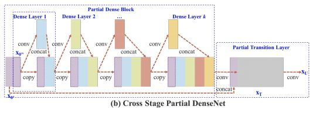

## YOLOv5 model
- Triển khai bằng Pytorch framework
- Input (640,640)
- Tự động học Bound Box Anchors
- Backbone-Cross-Stage Local Network (CSP)

- Neck-Path Aggregation Network (PANET) và SPP (spatial pyramid pooling)
- Head-YOLO general detection layer: Mỗi đầu là: 80(cls)+ 1(score)+ 4(tọa độ): 86 channels
- Cấu trúc mạng gồm 4 mẫu là yolov5 s,m,l,x khác nhau ở depth_multiple，width_multiple
- Hàm kích hoạt sử dụng leaky relu và sigmoid
- Tối ưu hóa sử dụng Adam và SGD, hàm loss là GIOU Loss

## YOLOX model
Giống như yolov5 nhưng yoloX có một số thay đổi:
- Thay head-Yolo thành decoupling head: do xung đột giữa phân loại và hồi quy nên tách ra làm 2 nhánh, sử dụng BCE loss cho phân loại và IOU loss cho hồi quy. Điều này giúp tăng độ chính xác những làm mô hình chậm đi.

- Ở yolov5 sử dụng anchor base sẵn, càng nhiều anchor sẽ làm tăng độ phức tạp và sô luơng dự đoán cho mỗi ảnh. Vì vây yoloX là dạng anchor-free(không dùng anchor) tức là thay vì dự đoán 4 giá trị 2 tọa độ và chiều rộng, cao của box. Nó sẽ xác định trung tâm của mỗi đối tượng và xác định trước 1 phạm vi tỷ lệ

### Thử trên cùng 1 máy
|Model |size |AP(%) | Parameters | Speed(/1frame)|
| ------    |:---:     |:---:  | :---: | :----: |
|Yolov5-s    |640  | 36.7 | 7.3M      |0.4 s     |
|YoloX-s   |640  | 39.6      |9.0M     |0.6 s |
